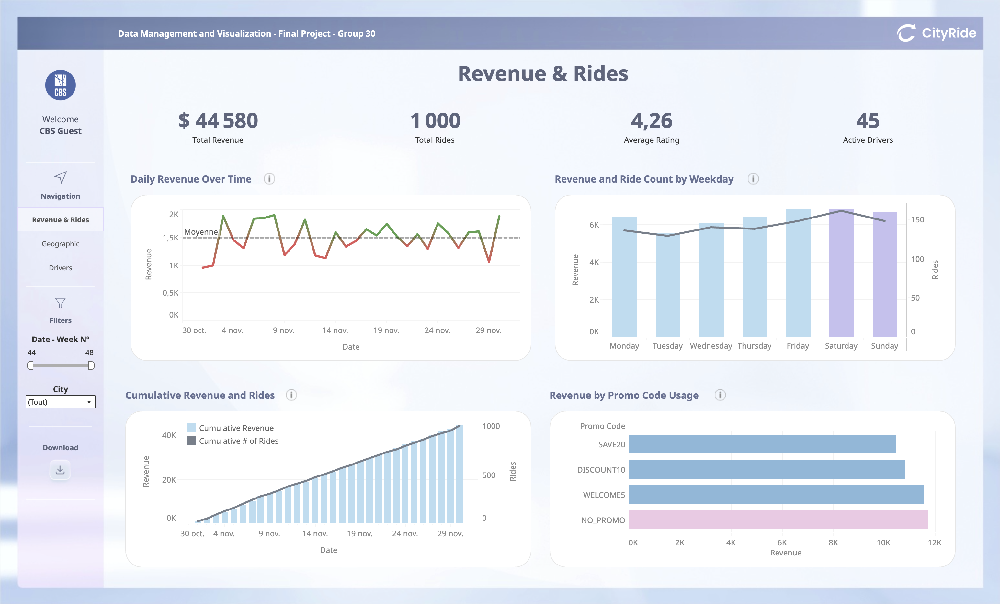
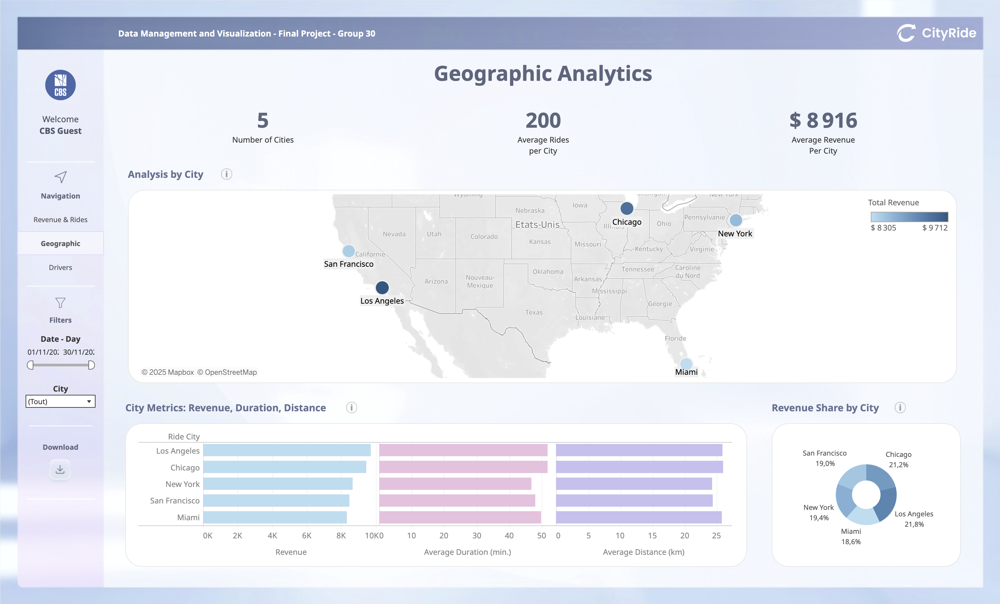
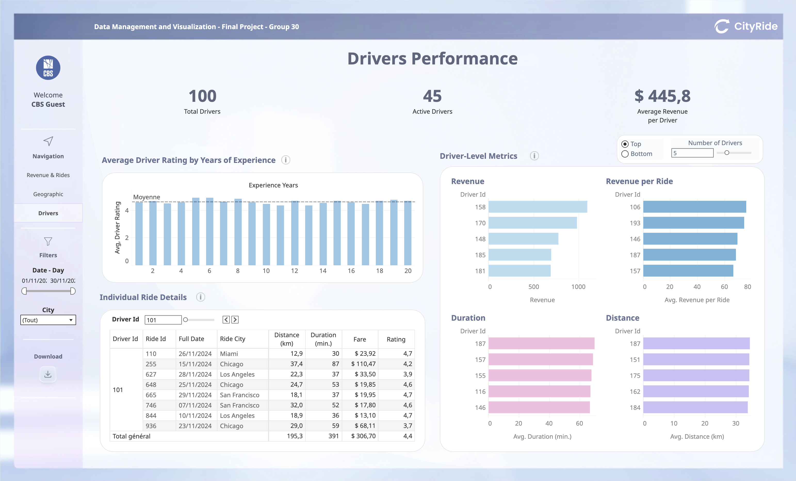

# CityRide Analytics Dashboard

A comprehensive data analytics solution for CityRide, a ride-sharing platform, transforming operational data into actionable business insights through exploratory analysis, data warehousing, and interactive visualization.

[](https://public.tableau.com/app/profile/david.cod/viz/FinalProject_Tableau_Group30/RevenueRides)
[](https://github.com/zakyikow/CBS_CityRide-Analytics/tree/main/1_R_data_prep_cleaning_EDA)
[](https://github.com/zakyikow/CBS_CityRide-Analytics/tree/main/2_SQL_data_transformation)

<br>

<table>
  <tr>
    <td width="30%" align="center"></td>
    <td width="30%" align="center"></td>
    <td width="30%" align="center"></td>
  </tr>
  <tr>
    <td align="center"><b>Revenue & Rides</b></td>
    <td align="center"><b>Geographic Analytics</b></td>
    <td align="center"><b>Drivers Performance</b></td>
  </tr>
</table>

<br>

## 📊 Project Overview

This project analyzes ride-sharing operations across 5 US cities, examining 1,000 rides and 100 drivers to identify performance patterns, optimize promotional strategies, and improve driver engagement. The solution provides a scalable data infrastructure and interactive dashboards for ongoing operational monitoring.

**Key Deliverables:**
- Exploratory data analysis revealing temporal and geographic patterns
- PostgreSQL star schema data warehouse with ETL pipeline
- Three-dashboard Tableau workbook for performance monitoring
- Data-driven recommendations for weekday growth and promotion optimization

<br>

## 🎯 Key Findings

- **Temporal Patterns**: Weekend demand peaks (Saturday: 161 rides) but weekday rides are 8% longer and generate higher average fares ($45.07 vs $43.48)
- **Promotion Overuse**: 73% of rides use promo codes, indicating discounts have become expected rather than strategic
- **Geographic Balance**: Revenue distributed evenly across markets (LA 21.8%, Chicago 21.2%, NY 19.4%)
- **Driver Engagement Gap**: 55% of registered drivers inactive; top 20% generate only 30% of revenue (flatter than typical 80/20 distribution)

<br>

## 🗂️ Repository Structure

```
CBS_CityRide-Analytics/
│
├── 0_raw_data/                                      # Original source data
│   ├── Drivers_Data.csv
│   └── Rides_Data.csv
│
├── 1_R_data_prep_cleaning_EDA/                      # R analysis workflow
│   ├── cityride_analysis.R                          # Complete R analysis script
│   └── CityRide_Analysis_Report.pdf                 # Detailed methodology report
│
├── 2_SQL_data_transformation/                       # Database implementation
│   ├── schema.sql                                   # Star schema DDL & ETL
│   └── star_schema.png                              # Database architecture diagram
│
├── 3_final_data/                                    # Analysis-ready dataset
│   └── vw_rides_analysis.csv                        # Unified analytical view
│
├── 4_Tableau/                                       # Interactive visualizations
│   ├── FinalProject_Tableau_Group30.twbx            # Packaged Tableau workbook
│   ├── Tableau_Dashboard1_RevenueRides.png          # Dashboard 1 preview
│   ├── Tableau_Dashboard2_GeographicAnalytics.png   # Dashboard 2 preview
│   └── Tableau_Dashboard3_DriversPerformance.png    # Dashboard 3 preview
│
├── .gitattributes
└── README.md
```

<br>

## 🛠️ Technologies Used

**Analysis & Visualization**
- **R**: Data cleaning, exploratory analysis, feature engineering
- **PostgreSQL**: Data warehousing with star schema architecture
- **Tableau**: Interactive dashboards with drill-down capabilities

**Key R Packages**: `dplyr`, `ggplot2`, `lubridate`

<br>

## 🔍 Database Design

Implemented star schema optimized for analytical queries:

**Fact Table**: `fact_rides` (ride transactions with pre-calculated metrics)

**Dimensions**: `dim_date`, `dim_city`, `dim_driver`, `dim_promo`

**ETL Process**: Three-stage pipeline (staging → transformation → fact/dimension loading) with data quality controls and derived metric calculations

<br>

## 📈 Dashboard Architecture

The Tableau workbook follows Shneiderman's "overview first, zoom and filter, details on demand" principle:

1. **Revenue & Rides**: Primary monitoring dashboard with KPIs, daily trends, weekday patterns, and promotional analysis
2. **Geographic Analytics**: City-level performance comparison with revenue share, distance/duration metrics, and map visualization
3. **Drivers Performance**: Driver segmentation, rating analysis, and individual ride details

<br>

## 💡 Business Recommendations

1. **Weekday Growth Strategy**: Implement weekday-specific driver incentives (5-10% higher payouts) and distance-based promotions targeting commuters (e.g., 10% off rides >23km, Monday-Friday only)

2. **Promotion Restructuring**: Move from blanket discounts to tiered, distance-based codes (10% off >20km, 15% off >30km) to protect margins on short trips while incentivizing high-value rides

3. **Driver Engagement Program**: Introduce "Premium Driver Status" for top performers with priority trip matching and quarterly bonuses; reactivation campaigns for inactive drivers with targeted incentives

4. **City-Specific Strategies**: Customize promotional approaches based on market behavior (Chicago shows promo users take longer trips; LA shows opposite pattern)

<br>

## ⚠️ Known Limitations

- **Timeframe**: Single-month snapshot (November 2024) limits seasonality analysis
- **Missing Cost Data**: Revenue tracking without driver payout or operational costs prevents profitability analysis
- **No Customer IDs**: Cannot track retention, lifetime value, or repeat usage patterns
- **External Context**: Lacks weather, traffic, and event data that may explain rating fluctuations

<br>

## 📊 View the Interactive Dashboard

[Live Tableau Dashboard](https://public.tableau.com/app/profile/david.cod/viz/FinalProject_Tableau_Group30/RevenueRides)

<br>

---

*For detailed methodology, complete findings, and technical documentation, see [CityRide_FinalPaper.pdf](5_PDF_Report/CityRide_FinalPaper.pdf)*
